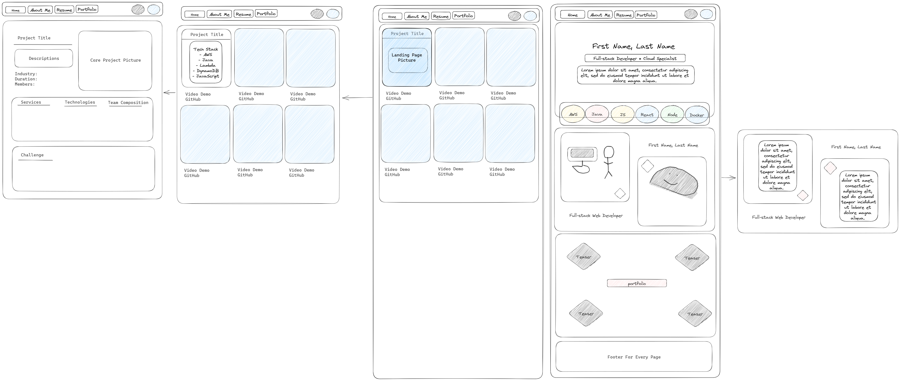
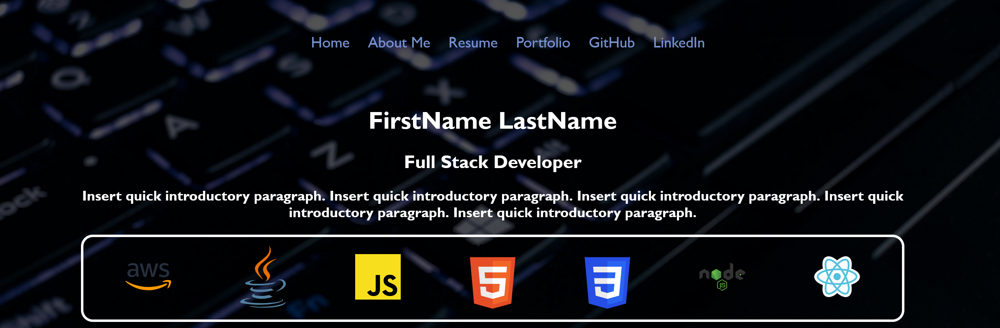

<div style="text-align: center">

<h2 align="center">Portfolio Website</h2>

---
## Synopsis

Gabe Guio and Alex Murillo, both graduates from Nashville Software School's Software Engineering Program found themselves in the middle of the tech recession of 2023, unemployed, and with time on their hands. Wanting to continue to expand on their skills and reinforce learned concepts, they decided to work together to build a template they could both utilize for portfolio websites to showcase their projects. As such, the "Portfolio Website" project was born.

---
## Lessons Learned

<div style="text-align: left">
1. How to build a website with React and JSX<br>
2. How BrowserRouter creates pages with Routes<br>
3. ReactDOM.Render versus createRoot<br>
4. How to apply CSS to subcomponents<br>
5. How to create a modal overlay<br>
</div>

---
## Build Tools
</div><div style="text-align: left">
* Javascript <br>
* React <br>
* JSX <br>
* HTML <br>
* CSS <br>
* Windows Powershell / Bash <br>
* Git <br>
* Github <br>
* Node.js <br>
* npm <br>
* AWS Route 53 <br>
* AWS S3 <br>
* AWS Cloudfront <br>

</div>

---
## Project Planning

  

---
## Project Planning



---
## How to Launch
1. Launch front end from the root directory with ```npm start``` <br>
2. If your browser doesn't automatically open within one minute, open index.html in your web browser via ```localhost:3000/```

---
## Contact

Alex Murillo - alex.d.murillo@protonmail.com
<br>
<a href="https://www.linkedin.com/in/alexdmurillo/"></a><br>

Gabe Guio - email@goesHere.com
<br>
<a href="https://www.linkedin.com/in/gabe-guio/"></a><br>


